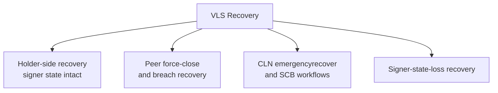
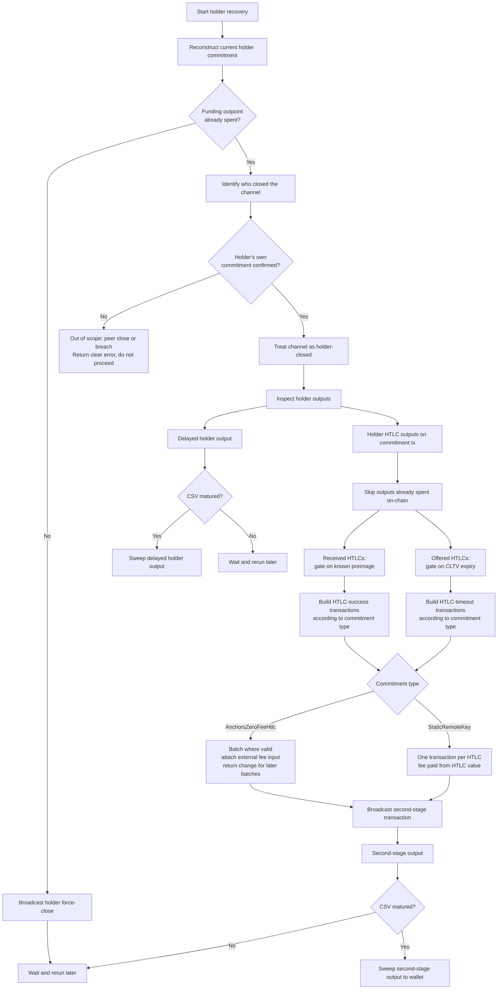
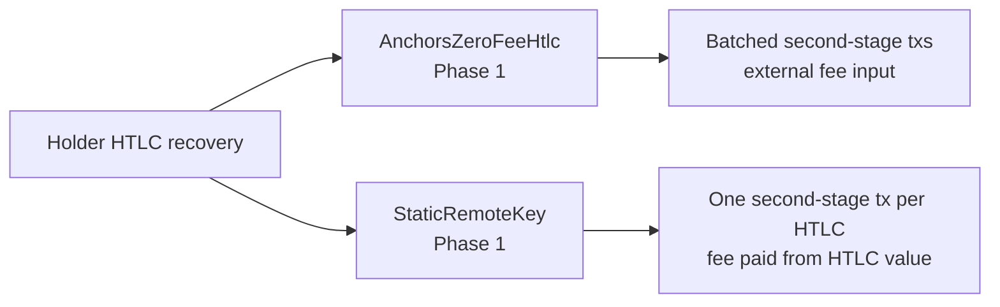

# Context

VLS has more than one recovery problem. The current repository [README](https://gitlab.com/lightning-signer/validating-lightning-signer/-/blob/a33ca3e03f24158c29042712acdba25e503040b8/README.md?plain=1#L7) still calls out three major gaps:
- `vlsd --recover-to` only handles a simple holder force-close today.
- It cannot recover peer force-closes, breaches, or HTLC outputs.
- There is no facility to recover from loss of signer state.

This means "recovery" is not one single feature. It is a family of related problems that need different state, different on-chain logic, and different operational flows.



This VIP is about the first box only: holder-side recovery when VLS still has the current signer state for the channel.

The following GitLab issues track the broader recovery work this VIP is part of:
- [#28](https://gitlab.com/lightning-signer/validating-lightning-signer/-/work_items/28): broad disaster recovery from node failure.
- [#179](https://gitlab.com/lightning-signer/validating-lightning-signer/-/work_items/179): peer force-close and breach cases.
- [#494](https://gitlab.com/lightning-signer/validating-lightning-signer/-/work_items/494): CLN `emergencyrecover` interoperability.
- [#524](https://gitlab.com/lightning-signer/validating-lightning-signer/-/work_items/524): static channel backup validation for CLN+VLS workflows.

Those issues are important context, but they are not the design target of this document.

# Goals

- Define one clear holder-side recovery flow that starts from intact signer state.
- Make the operator flow easy to understand, rerun, and reason about.
- Cover reconstruction of the latest holder commitment transaction from signer state.
- Cover the decision between force-closing now versus continuing recovery after the channel is already closed.
- Cover recovery of the delayed holder output and claimable holder HTLC outputs.
- Cover the two-stage HTLC claim process: broadcasting the second-stage HTLC transaction and then sweeping its CSV-delayed output once mature.
- State the commitment-type boundary of the initial implementation clearly, including the different HTLC transaction rules for `AnchorsZeroFeeHtlc` and `StaticRemoteKey`.
- Identify who closed the channel before deciding which outputs are claimable.

# Non Goals

- Peer force-close recovery.
- Breach remedy or justice transaction design.
- CLN `emergencyrecover` or static channel backup design.
- Recovery from loss of signer state.
- Designing a full `ChannelMonitor` replacement.
- Holder-side recovery for commitment types other than `AnchorsZeroFeeHtlc` and `StaticRemoteKey`.
- General mempool, rebroadcast, or fee-bumping policy.

# Key Considerations

- **Source of truth:** The signer state is the source of truth for this VIP, not the node.
- **Rerun safety:** Recovery must be safe to invoke multiple times after partial on-chain progress.
- **Chain-first progress checks:** Current chain state is preferred over local checkpoint state when deciding what to skip or broadcast.
- **Claimability:** Offered and received HTLCs have different rules and must be treated differently.
- **Commitment type differences:** The delayed-output flow is broadly reusable, but HTLC recovery differs materially between `AnchorsZeroFeeHtlc` and `StaticRemoteKey`.
- **Close authorship:** Before deciding which outputs are claimable, recovery must determine whether the holder or the counterparty spent the funding outpoint. The claim paths, output structures, and timing constraints differ materially between the two cases.
- **Simplicity:** The design should be understandable by operators and reviewers before it is clever.

# Design

The recovery flow starts by rebuilding the current holder commitment transaction directly from persisted signer state. This gives the operator a deterministic view of holder-side recovery even if the node itself is gone or inconsistent.

After reconstructing the holder commitment transaction, recovery uses the configured chain backend to check the funding outpoint. The concrete lookups required by this step are listed in [Chain State Dependencies](#chain-state-dependencies).

- If the funding outpoint is still unspent, recovery signs and broadcasts the reconstructed holder commitment transaction through the backend, reports the close transaction id, and exits. Recovery does not wait in-process for confirmation; the operator reruns recovery after the force-close confirms.
- If the funding outpoint is already spent, recovery must identify the transaction that spent it before proceeding. If that transaction matches the holder's reconstructed force-close and is confirmed, recovery continues with output-level recovery. If the force-close is seen but not yet confirmed, recovery reports the pending transaction and exits so the operator can rerun later. If a different transaction closed the channel, this is a counterparty close or breach and falls outside this VIP's scope. Recovery should surface a clear out-of-scope error in that case rather than silently proceeding with incorrect assumptions.

Once the holder commitment is confirmed on-chain, recovery tracks two classes of outputs:

- **The delayed holder output**: our main `to_local` commitment output, encumbered
  by `to_self_delay` CSV blocks before it can be swept to the configured recovery
  address.

- **The holder-side HTLC outputs**: unresolved HTLC outputs still claimable on the
  holder commitment -- received HTLCs for which we know the preimage, and offered
  HTLCs that can be timed out after their `cltv_expiry`. These are first spent via
  HTLC-success or HTLC-timeout transactions, and the resulting second-stage outputs
  are then encumbered by `to_self_delay` CSV blocks before they can be swept.



The rerun model is intentional. Recovery should assume that operators may run it several times:
- before the force-close confirms,
- after some outputs mature,
- after second-stage HTLC transactions are broadcast but before their CSV outputs mature,
- after some HTLC outputs were already claimed,
- after partial success.

For that reason, already-spent HTLC outputs and already-confirmed second-stage transactions must be treated as normal progress, not as hard errors.

Recovery does not wait in-process for CLTV or CSV maturity and does not queue delayed broadcasts. If an offered HTLC is not yet claimable, recovery reports the remaining CLTV expiry height for the relevant timeout batch and exits. If a delayed output or second-stage HTLC output is not yet CSV-mature, recovery reports the maturity state and exits. The operator is responsible for rerunning recovery after the reported height.

## Commitment Type Boundary

The holder HTLC recovery path differs materially between commitment types:



Phase 1 supports holder HTLC recovery for both `AnchorsZeroFeeHtlc` and `StaticRemoteKey`, but their second-stage transaction rules differ materially:
- `AnchorsZeroFeeHtlc` second-stage transactions are zero-fee before sponsorship. Compatible HTLCs can be batched, and recovery must attach an explicit external fee input before broadcast.
- `StaticRemoteKey` second-stage transactions are not batched. Recovery builds one HTLC-timeout or HTLC-success transaction per HTLC output, signs with `SIGHASH_ALL`, and pays fees directly from the HTLC value rather than from an external fee input.

### AnchorsZeroFeeHtlc Batching Rules

`AnchorsZeroFeeHtlc` second-stage transactions follow two distinct batching rules depending on HTLC direction:

- **Received HTLCs** (HTLC-success): all received HTLCs with a known preimage can be batched into a single HTLC-success transaction regardless of their individual CLTV values. The success path has no CLTV constraint — only the preimage is required — so there is no timing reason to split them.
- **Offered HTLCs** (HTLC-timeout): each batch must share the same `cltv_expiry`, as BOLT 3 requires `locktime == cltv_expiry` for HTLC-timeout transactions. Each batch can only be broadcast once that expiry has passed, so HTLCs with different expiries are built as separate batches.

`StaticRemoteKey` HTLC second-stage transactions are not batched; each claimable HTLC output is handled by a separate transaction.

### AnchorsZeroFeeHtlc Fee Input Requirement

`AnchorsZeroFeeHtlc` second-stage transactions carry zero fee by construction. They cannot be broadcast as built, so an external VLS wallet UTXO must be attached as a fee input before broadcast. Recovery must source this input explicitly, attach it to the second-stage transaction, and return change in a way that can fund subsequent recovery batches. This fee input step is a required part of the broadcast flow, not an optional optimisation.

For Phase 1, change handling is deterministic rather than wallet-discovery based. The operator supplies the fee input as `--input-utxo <txid>:<vout>:<value_sat>:<derivation_path>`, and recovery sends any change back to the native-wallet script derived from that same `derivation_path`. This intentionally reuses the already revealed fee-input address for now, avoids revealing an additional wallet address, and keeps the resulting change UTXO signable by VLS using the same path. Within a single run, recovery can carry the change UTXO forward in memory as the next fee input. Across runs, `vlsd` should print the exact `--input-utxo` value for the change output so the operator can pass it back on the next invocation. Change is not sent to `--recover-to`, because that address may not be signable by VLS and would not be usable as a later recovery fee input.

`StaticRemoteKey` holder force-close, delayed-output recovery, and second-level HTLC recovery use the common holder-side flow where possible, but its HTLC transaction construction remains different: one HTLC-timeout or HTLC-success transaction per HTLC output, no batching, and fees paid directly from the HTLC value rather than via an external fee input. The second-stage CSV sweep then follows the same pattern but applies per transaction.

## Chain State Dependencies

This design depends on the following concrete chain lookups:
- **Funding outpoint status:** whether the funding output is unspent, and if spent, which transaction consumed it.
- **Commitment transaction identity:** whether the spending transaction matches the holder's reconstructed commitment, a known counterparty commitment, or an unrecognised transaction.
- **HTLC outpoint spend status:** whether each holder HTLC output on the commitment transaction has already been spent on-chain, so reruns treat prior second-stage broadcasts as progress rather than errors.
- **Second-stage output spend and maturity status:** whether the output of each second-stage HTLC transaction has been spent, and whether its CSV delay has matured, so the sweep step can be gated correctly on reruns.

The recovery backend also needs broadcast support: ability to submit transactions to the mempool and confirm submission.

Rerun safety works operationally because each recovery step checks current chain state before acting, and already-spent outputs are never treated as failures.

An implementation may keep a local recovery checkpoint file for operator convenience and faster reruns, for example to remember transactions prepared or submitted in an earlier invocation. This checkpoint is only a cache of recovery progress. It must not be the authority for deciding that an output is safe to skip, that a transaction is confirmed, or that a CSV/CLTV gate has matured. On each invocation, recovery should prefer fresh chain lookups and use any local checkpoint only to reduce repeated work or improve reporting after the chain backend confirms the relevant state. If the local checkpoint and chain view disagree, the chain view wins and recovery should continue from the chain-observed state.

## `vlsd` Operator Interface

Holder-side recovery is exposed as a one-shot `vlsd` mode rather than as a separate `vls-cli` workflow. When `--recover-to` is present, `vlsd` loads signer state, runs the recovery path, reports progress or required operator action, and exits instead of starting the normal signer service.

The base invocation is:

```text
vlsd --recover-to <bitcoin-address> [--dry-run] [recovery options]
```

`--dry-run` signs or prepares the candidate transactions and prints the recovery status, but does not broadcast force-close, HTLC second-stage, or sweep transactions. The operator still provides `--recover-to <bitcoin-address>` so the dry run exercises the same destination and policy checks as a real recovery run.

For Phase 1 HTLC recovery, the operator must provide a fee rate. `AnchorsZeroFeeHtlc` recovery also requires explicit fee inputs for HTLC second-stage transactions:

- `--fee-rate <sat_per_kw>`: fee rate for recovery transactions. It must be greater than zero.
- `--input-utxo <txid>:<vout>:<value_sat>:<derivation_path>`: wallet UTXO used to pay `AnchorsZeroFeeHtlc` recovery fees. This option may be repeated.

The `--input-utxo` value must identify a native-wallet UTXO and include the derivation path needed for VLS to sign that fee input. For `AnchorsZeroFeeHtlc`, the external fee input is required because the second-stage HTLC transactions are zero-fee before sponsorship. If a fee input creates change, recovery sends it back to the same native-wallet derivation path. This is intentional address reuse in Phase 1: the address was already revealed by the fee input, and reusing it avoids revealing another wallet address. Recovery may carry that change forward to fund later HTLC batches in the same run, and should print the resulting `--input-utxo` value for any later run.

If the funding outpoint is already spent, recovery must identify the transaction that spent it before continuing. The recovery backend therefore needs funding-spender lookup support. If the selected backend cannot identify the spender, `vlsd` should report that already-closed channel recovery requires an Esplora-backed recovery run, for example with `--recover-type esplora --recover-rpc <url>`.

Operator-facing output should make the recovery state machine explicit without requiring the operator to infer it from raw transaction data. It should report:

- the funding outpoint being processed,
- whether the channel is still open, already holder-closed, or out of scope because the counterparty or an unknown transaction closed it,
- the holder commitment transaction id when reconstructed,
- each force-close, HTLC second-stage, and delayed-output sweep transaction that is broadcast or prepared in dry-run mode,
- HTLC outputs skipped because they are already spent,
- offered HTLC batches that are not yet claimable, including their CLTV expiry heights,
- delayed outputs and second-stage HTLC outputs that are not yet CSV-mature, including enough maturity information for the operator to know when rerunning may help.

The expected error and status cases are:

- Missing `--fee-rate`: report that holder-side HTLC recovery requires a fee rate and skip the channel.
- `--fee-rate 0`: report that the fee rate must be greater than zero and skip the channel.
- Missing `--input-utxo`: for `AnchorsZeroFeeHtlc`, report that at least one wallet fee UTXO is required, including the `txid:vout:value:derivation_path` format.
- Unusable or too-small fee UTXO: for `AnchorsZeroFeeHtlc`, warn about the skipped fee UTXO. If no usable fee UTXO remains, report that no fee UTXO can pay the requested fee rate and leave the affected HTLC transaction unbroadcast.
- Unsupported commitment type: warn and skip the channel. Phase 1 supports holder-side close, delayed-output, and second-level HTLC recovery for `AnchorsZeroFeeHtlc` and `StaticRemoteKey`.
- Already-closed channel with a backend that cannot identify the funding spender: report that the operator must rerun with a backend that supports spender lookup.
- Counterparty close or unknown close: report that the case is out of scope for this VIP and do not attempt holder-output recovery.
- CLTV or CSV not yet mature: report the relevant height or maturity state and exit. Recovery is resumed by rerunning `vlsd`; it is not scheduled internally.
- Already-spent HTLC or sweep outputs: report them as normal progress and continue with remaining claimable outputs.

## Implementation Sequencing

This VIP covers holder-side close, delayed-output, and second-level HTLC recovery for the commitment types listed below.

| Phase | Scope | VIP |
|---|---|---|
| Phase 1 | Holder-side close/delayed-output recovery + `AnchorsZeroFeeHtlc` and `StaticRemoteKey` HTLC recovery | This VIP |
| Future VIP | Peer force-close and breach recovery | [#179](https://gitlab.com/lightning-signer/validating-lightning-signer/-/work_items/179) |

# Implementation Details

The implementation is expected to land in three connected layers.

**Recovery orchestration layer:**
- Use the signer state to reconstruct the latest holder commitment transaction.
- Query the chain view to decide whether the funding outpoint is still live.
- If the funding outpoint is spent, identify the closing transaction and confirm it matches the holder's commitment before continuing. Return a clear out-of-scope error if it does not.
- If the channel is holder-closed, inspect holder HTLC outputs and record which ones have already been spent.
- Optionally read and write a local checkpoint file for faster operator reruns, while treating the chain view as authoritative before skipping or broadcasting any recovery transaction.
- Keep dry-run support so the operator can see what recovery would do before broadcasting.

**Holder output recovery layer:**
- Recover the delayed holder output once the required CSV delay has matured.
- Treat already-spent outputs as normal progress.
- Require that offered HTLCs are only recovered after CLTV expiry.
- Require that received HTLCs are only recovered when the signer knows the payment preimage.

**Holder HTLC transaction layer:**
- Phase 1 supports both `AnchorsZeroFeeHtlc` and `StaticRemoteKey` holder HTLC recovery.
- Stage 1: build and broadcast second-stage transactions.
  - For `AnchorsZeroFeeHtlc`, batch all received HTLCs with a known preimage into a single HTLC-success transaction regardless of their individual CLTV values.
  - For `AnchorsZeroFeeHtlc`, batch offered HTLCs into HTLC-timeout transactions grouped by CLTV expiry. HTLCs with different expiries must not be mixed into the same batch.
  - For `AnchorsZeroFeeHtlc`, attach an external fee input to each second-stage transaction before broadcast. Return change from that input in a way that can fund subsequent batches in the same recovery session.
  - For `StaticRemoteKey`, build and broadcast one `SIGHASH_ALL` HTLC-timeout or HTLC-success transaction per claimable HTLC output, with fees paid from the HTLC value.
- Stage 2: once each second-stage transaction confirms, track its output CSV delay. When mature, sweep the second-stage output to the wallet. Treat already-swept outputs as normal progress on reruns.

The implementation may also need supporting persistence work so local-only recovery uses committed signer state consistently and does not behave differently from cloud-backed persistence in restart-sensitive cases.

# Test Plan

Testing will be done at three levels:
- **Core unit tests (`vls-core`)**: cover the recovery primitives in isolation, including reconstructing the current holder commitment transaction from signer state, identifying the holder's own closing transaction, computing spent HTLC indices, gating HTLC claims on CLTV/preimage/CSV, and validating `sign_holder_commitment_tx_for_recovery` transaction construction and batching rules.
- **Recovery integration tests (`vlsd`)**: cover orchestration of the holder recovery flow, including force-close when funding is still live, resume-after-close when the holder commitment is already confirmed, reruns after partial progress, second-stage HTLC broadcast, CSV-delayed sweep handling, required recovery arguments, and operator-facing status/error output.
- **End-to-end tests (`lnrod`)**: cover the full operator-facing recovery flow against a real node setup, including repeated recovery runs, external fee input usage, and successful recovery across both the commitment stage and the HTLC second-stage/sweep stage.

The test suite should specifically verify:
- recovery is driven from signer state rather than node state
- already-spent outputs are treated as normal progress on reruns
- optional checkpoint state never overrides current chain lookups
- peer-close and unknown-close cases fail clearly as out of scope
- `AnchorsZeroFeeHtlc` batching and fee-input handling behave correctly
- `StaticRemoteKey` HTLC recovery builds one transaction per HTLC output and pays fees from the HTLC value
- missing or zero fee rates, and missing, too-small, or unusable `AnchorsZeroFeeHtlc` fee inputs, produce clear operator messages
- CLTV/CSV waits are reported as rerun-later status rather than handled by internal scheduling

# Changelog

- 1.0.0 (2026-05-28):
  Initial approved version. Covers holder-side force-close and output recovery with intact signer state, including two-stage HTLC claim flow, close authorship detection, `AnchorsZeroFeeHtlc` batching and fee input requirements, and `StaticRemoteKey` one-HTLC-per-transaction recovery.
